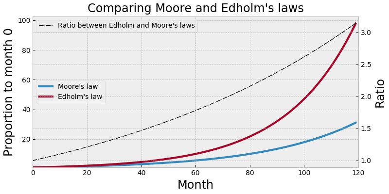

# matplotlib_styles
Exploring matplotlib styles

## Guidelines

- Mostly avoid importing `matplotlib.pyplot`: just the things that are
  needed. We do not want to use the Matlab inspired interface in as
  much as possible
    
## Examples

